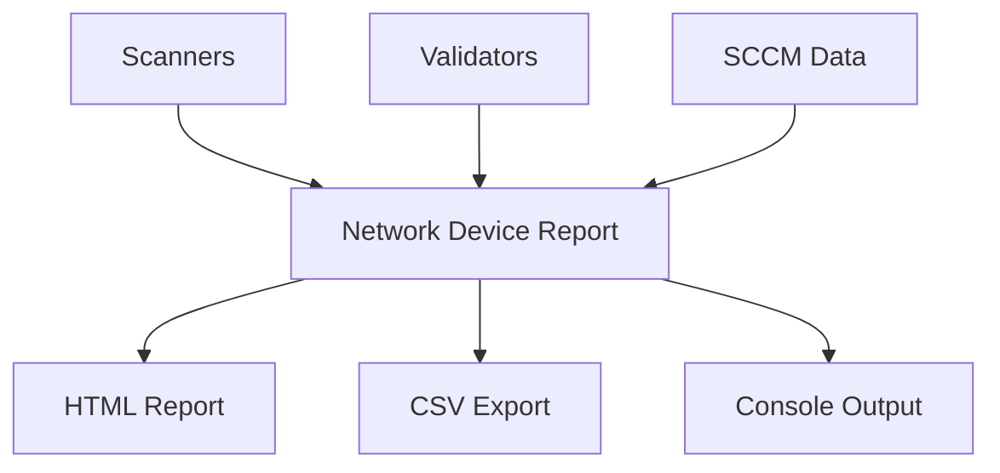

# Network Validation Suite - Functionality Map

## Core Components

### 🎮 Invoke-NetworkValidation (Orchestrator)

- Menu-driven interface for all tools
- Parameter-based direct execution
- Validation strategies:
  - Basic: Quick ping and DNS
  - Advanced: Full DNS chain validation
  - Subnet: Network range scanning
- Results correlation and confidence scoring
- Real-time progress tracking

### 📊 Get-NetworkDeviceReport (Consolidator)

- Comprehensive device status reporting
- Multiple output formats:
  - Console with color coding
  - HTML with interactive elements
  - CSV for data analysis
- Summary statistics and metrics
- MAC vendor resolution
- Progress tracking with ETA

### 🔄 Get-SCCMInventory

- Cross-domain SCCM querying
- Intelligent cache management
- System location verification
- Migration status tracking
- Domain transition detection

## Validators

### 🔍 Test-DomainResolution

- Multi-domain DNS validation
- Trust path verification:
  - CVS ←→ AUTH ←→ IM1
  - Forward/reverse lookup validation
- Parallel processing with runspaces
- SCCM data correlation
- Detailed HTML reporting
- Stale record detection

### 📱 Get-InfoBloxIPInfo

- IPAM system integration
- Device information:
  - MAC addresses
  - Network details
  - Lease status
  - Usage types
- Parallel query processing
- Rate-limited API handling

## Scanners

### 🌐 Test-NetworkConnection

- Multi-threaded ping operations
- Response metrics:
  - Latency tracking
  - Packet loss detection
  - Route analysis
- Real-time status monitoring
- Progress tracking with statistics

### 🔎 Scan-IPv4Range

- Subnet discovery and mapping
- Device detection:
  - Active hosts
  - MAC resolution
  - DHCP status
- Network topology mapping
- Performance-optimized scanning

## Integration Points

### Data Flow

### Cross-Domain Awareness

- CVS Domain Integration
- IM1 Domain Integration
- AUTH Domain Handling
- Trust Relationship Validation

### Performance Features

- Runspace Pool Management
- Smart Batching
- Cache Optimization
- Rate Limiting
- Progress Tracking

### Reporting Capabilities

- Real-time Console Updates
- Interactive HTML Reports
- Data Export Options
- Summary Statistics
- Trend Analysis

## Module Information

`NetworkValidation\NetworkValidation.psd1`
